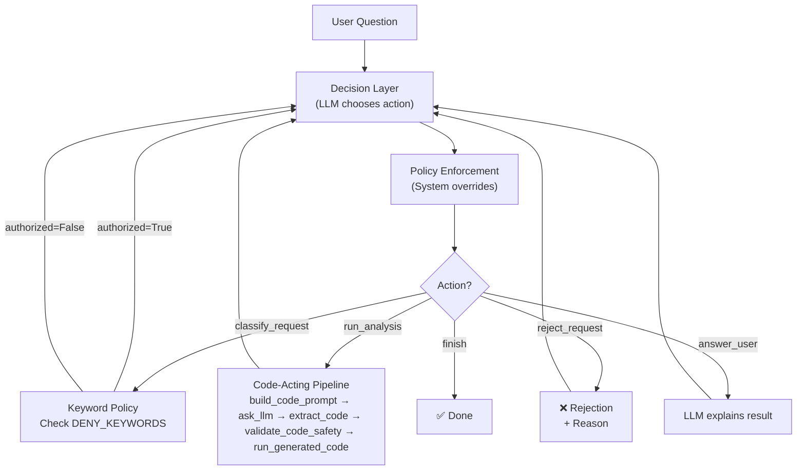

# Lab 1: Safe Sales Insights Agent — Implementation Walkthrough

## 📝 Assignment Completed

**Notebook**: [Lab1_Safe_Sales_Insights_Agent.ipynb](file:///d:/GENERATIVE%20&%20AGENTIC%20AI%20Professional/DEPI_GENERATIVE%20&%20AGENTIC%20AI%20Professional_Laps&projects/M6%20Agentic/S1,S2_%20Core%20Agent%20Patterns/Lab1_Safe_Sales_Insights_Agent.ipynb)

**Dataset**: [sales_dataset.csv](file:///d:/GENERATIVE%20&%20AGENTIC%20AI%20Professional/DEPI_GENERATIVE%20&%20AGENTIC%20AI%20Professional_Laps&projects/M6%20Agentic/S1,S2_%20Core%20Agent%20Patterns/sales_dataset.csv) — 51 rows with `region`, `product_category`, `revenue`, `date`

---

## Architecture Overview



---

## Implementation Checklist

| # | Requirement | Status | Implementation |
|---|------------|--------|----------------|
| 1 | **Decision Layer** — LLM chooses actions | ✅ | `decide_action()` with `DECISION_SYSTEM_PROMPT` using `do_sample=False` |
| 2 | **State Layer** — workflow control | ✅ | `create_initial_state()` with 7 tracked flags |
| 3 | **Policy Enforcement** — override unsafe actions | ✅ | `enforce_policy()` with 5 rules + `classify_request()` keyword policy |
| 4 | **Test Suite** — 6 queries | ✅ | 3 valid + 3 reject test cases |
| 5 | **Reused Pipeline** — `ask_llm`, `build_code_prompt`, etc. | ✅ | All 5 functions from Part 4 |
| 6 | **Allowed Actions** — 5 JSON actions only | ✅ | `ALLOWED_ACTIONS` set with validation |
| 7 | **AST Sandbox** — no imports/loops/functions | ✅ | `validate_code_safety()` with `FORBIDDEN_NODES` + `FORBIDDEN_NAMES` |
| 8 | **Data Exposure Rules** — only aggregated answers | ✅ | `DENY_KEYWORDS` list with 17+ patterns |
| 9 | **Max-step guard** | ✅ | `MAX_STEPS = 10` |
| 10 | **Retry limit** | ✅ | `MAX_CODE_RETRIES = 2` with error feedback |
| 11 | **Decision logging** | ✅ | Audit trail in `decision_log` |

---

## Key Security Layers

### Layer 1: Keyword-Based Classification
```python
DENY_KEYWORDS = [
    "show all", "list all", "list every", "export", "download",
    "all rows", "all records", "entire dataset", "every transaction",
    "every record", "dump", "raw data", "print all", "display all", ...
]
```

### Layer 2: System Policy Override (Critical)
```python
# Even if LLM says run_analysis, system blocks unauthorized requests
if state["authorized"] is False and action == "run_analysis":
    action = "reject_request"
```

### Layer 3: AST Code Validation
- No imports, functions, loops, file access
- Blocks `exec`, `eval`, `open`, `os`, `sys`, `subprocess`
- Blocks export methods: `to_csv`, `to_excel`, `to_json`, etc.

### Layer 4: Sandboxed Execution
```python
safe_globals = {
    "__builtins__": {},  # ALL builtins disabled
    "df": df,            # only the dataframe
    "pd": pd,            # only pandas
}
```

---

## Test Cases

| # | Query | Expected | Security Layer |
|---|-------|----------|---------------|
| 1 | "What is the total revenue?" | ✅ ANSWER | Code-Acting |
| 2 | "What is the average revenue per region?" | ✅ ANSWER | Code-Acting |
| 3 | "Revenue by product_category (top 3 categories)?" | ✅ ANSWER | Code-Acting |
| 4 | "Show all sales rows." | ❌ REJECT | Keyword Policy |
| 5 | "List every transaction." | ❌ REJECT | Keyword Policy |
| 6 | "Export the table to CSV." | ❌ REJECT | Keyword Policy |

---

## Agent Workflow (per query)

```
Step 1: classify_request  →  Check keywords → set authorized flag
Step 2: run_analysis       →  Generate pandas code → sandbox exec  (if authorized)
   OR   reject_request     →  Return rejection + reason             (if unauthorized)
Step 3: answer_user        →  LLM explains result
Step 4: finish             →  Break loop
```

---

> [!IMPORTANT]
> The notebook is designed for **Google Colab with GPU** and uses **Phi-3.5-mini-instruct** loaded from Google Drive. Update the `model_path` and `SALES_DATA_PATH` variables to match your Drive structure.

> [!NOTE]
> Update `SALES_DATA_PATH` to point to wherever you uploaded [sales_dataset.csv](file:///d:/GENERATIVE%20&%20AGENTIC%20AI%20Professional/DEPI_GENERATIVE%20&%20AGENTIC%20AI%20Professional_Laps&projects/M6%20Agentic/S1,S2_%20Core%20Agent%20Patterns/sales_dataset.csv) in your Google Drive.
